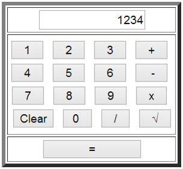

#### Task 1

Start Visual Studio and create new Web Forms App. Look at the files generated and tell what's purpose of each file. Explain the "code behind" model. Print "Hello, ASP.NET" from the C# code and from the aspx code. 

#### Task 2

Create a simple `aspx` page that enters a name and prints "Hello" + name in the page. Use a TextBox + Button + Label.

#### Task 3 - Lifecycle
Check all the events in the page execution lifecycle using appropriate methods or event handlers.

#### Task 4 - Students and Courses

Make a simple Web form for registration of students and courses. The form should accept first name, last name, faculty number, university (drop-down list), specialty (drop-down list) and a list of courses (multi-select list) and display them on submit. Use the appropriate Web server controls. After submission you should display summary of the entered information as formatted HTML. Use dynamically generated tags `(<h1>, 
, …)`.

#### Task 5 - Web Calculator

Make a simple Web Calculator. The calculator should support the operations like addition, subtraction, multiplication, division and square root. Validation is essential!

#### Task 6 - User Portal

1. Implement a simple Web Forms application using master pages. 
2. The application should be like a user profile – separate pages for Personal Info, Friends, Additional Info, etc. + Sidebar for navigation.

#### Task 7 - Validation Controls 
1. Create a form to register users with fields for preferred user name, password, repeat password, first name, last name, age, email, local address, phone and an “I accept” option.
1. All fields are required.
1. Valid age is between 18 and 81.
1. Display error messages in a ValidationSummary.
1. Use a regular expression for the email and phone fields.
1. Separate the fields in groups and validate them using Validation Groups. The Validation Groups should be at least three – Logon Info, Personal Info, Address Info.
1. Add a radio button to choose the gender (male / female). If the user is male, dynamically display a list of check boxes for choosing his favourite cars (e.g. BMW, Toyota, etc.). If the user is female display a drop-down list to allow her select her favourite coffee (e.g. Lavazza, New Brazil, etc.). Note that selecting a coffee is optional for the female users. Implement this by server PostBacks.
1. Implement the previous with client-side JavaScript.

#### Task 8 

1. Implement a Web Forms application using nested master pages.
2. It should be a Web site of international company.
3. You should have master layout page and few different nested master pages for each country and few content pages in different language, for each country.
4. Define "Home", "About" and "Contacts" pages for each country using its master page.

#### Task 9

Add Web Forms project to book library project.